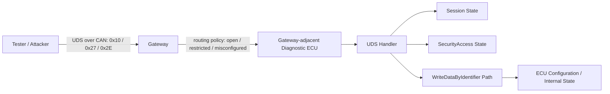
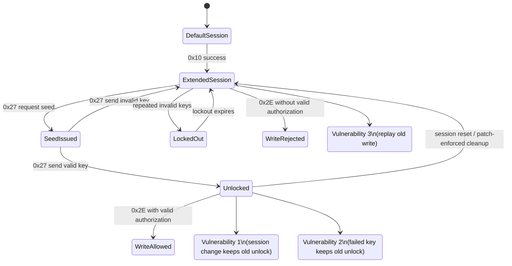
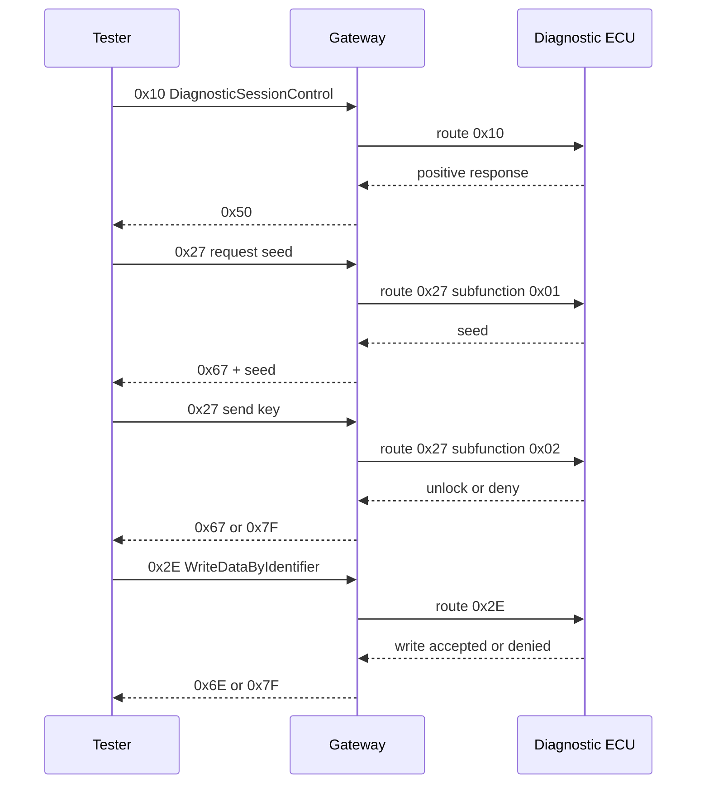
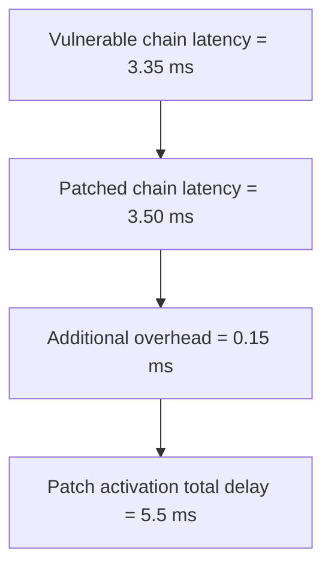

<!--
- 这个文件用于导出 thesis 当前需要的核心图表。
- 图表采用 Mermaid + Markdown 表格
-->

# Thesis Charts

## 1. Gateway-routed UDS 攻击路径

## 2. UDS 状态机与漏洞位置

## 3. 0x10 -> 0x27 -> 0x2E 服务链

## 4. Fleet 策略比较里程碑

下面的里程碑来自当前默认 `20` 台车 fleet 抽象模拟结果。

```mermaid
gantt
    title Fleet Comparison Milestones (20 Vehicles)
    dateFormat  X
    axisFormat %L min

    section OTA-only
    First protection          : milestone, ota_first, 30, 0
    80% protected             : milestone, ota_80, 525, 0
    Full campaign finished    : milestone, ota_full, 755, 0

    section Hotpatch-first
    First protection          : milestone, hp_first, 2, 0
    80% protected             : milestone, hp_80, 27, 0
    Full OTA finished         : milestone, hp_full, 755, 0
```

## 5. Fleet 指标表

| Metric | OTA-only | Hotpatch-first |
|---|---:|---:|
| Time to first protection (min) | 30 | 2 |
| Time to 80% protection (min) | 525 | 27 |
| Full campaign finish (min) | 755 | 755 |
| Cumulative exposure window (min) | 6605 | 2787 |
| Response unavailable vehicle minutes | 600 | 152 |
| Total unavailable vehicle minutes | 600 | 632 |
| Scheduled actions | 20 | 36 |

结论：
- `hotpatch-first` 明显缩短了保护时间和累计暴露时间。
- `hotpatch-first` 的总不可用时间略高，因为后续仍然要完成完整 OTA。

## 6. Timing Model 比较

下面的结果来自当前默认 timing model。

| Metric | Vulnerable | Patched |
|---|---:|---:|
| Total attack chain latency (ms) | 3.35 | 3.50 |
| Write handler latency (ms) | 0.90 | 1.05 |
| Periodic task jitter (ms) | 0.225 | 0.263 |
| Patch activation total delay (ms) | 5.5 | 5.5 |
| Patch rollback delay (ms) | 1.2 | 1.2 |

结论：
- 补丁后的 `0x2E` 写路径有小幅开销增长。
- 当前 timing model 仍然保持有界开销，适合后续在硬件实验里替换成真实测量值。

## 7. 用于 thesis 的图

1. `Gateway-routed UDS 攻击路径`
2. `UDS 状态机与漏洞位置`
3. `Fleet 策略比较里程碑`
4. `Timing Model 比较`
